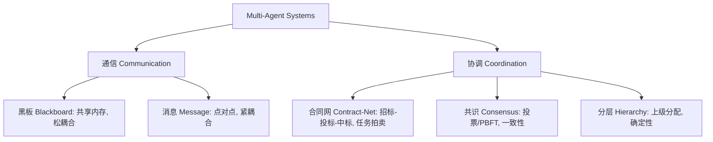

# Multi-Agent Systems 一句话速览图

## 怎么用
1. 先画黑板：所有 Agent 把子任务/中间结果写上去，谁有空谁领。→ 解耦最高。  
2. 急活走消息：直接 @ 对应角色，低延迟。  
3. 任务拆分用合同网：Manager 发「招标」→ 各 Agent 回「投标（报价/时长）」→ 选最优「中标」。  
4. 要一致再共识：关键决策投票，防脑裂。  

## 口诀
黑板松耦合，消息点对点；合同网拍卖，共识保一致。